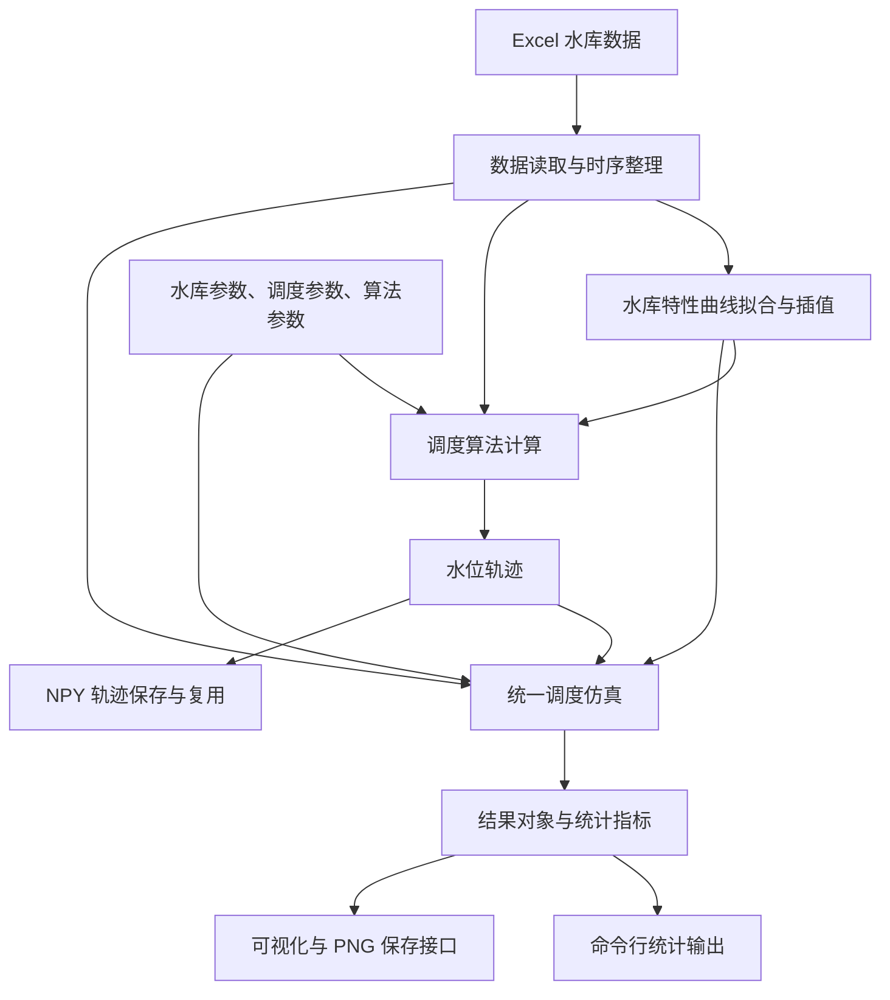

# 集成多种算法的水库优化调度软件 V1.0

**Reservoir-Dispatching** 是面向单水库水电站中长期运行分析的 Python 程序，以逐月入库流量、水库特性曲线和调度图为输入，开展常规调度、优化调度、结果仿真与可视化分析。

软件集成常规调度、动态规划（DP）、逐步优化（POA）、离散微分动态规划（DDDP）、Dhole 优化（DOA）和粒子群优化（PSO）六种调度算法。仓库还提供 XGBoost 调度函数模块，用于学习参考调度方案中的出库流量决策。

本 README 依据当前源代码编写，可作为软件介绍、运行说明和后续软件著作权说明书的基础材料。当前程序采用**命令行交互和 Matplotlib 图形窗口**，默认算例采用天一水库相关数据格式，调度尺度为月，默认计算长度为 73 个调度年、876 个时段。

> 当前工作区缺少默认输入文件 `data/data_ty.xls`，直接运行主程序会提示数据文件不存在。运行前须准备符合下文结构的数据。已有 `.npy` 水位轨迹属于历史输出，不代表当前环境已经完成重新计算。

## 目录

- [1. 软件概况与主要功能](#1-软件概况与主要功能)
- [2. 算法组成与功能范围](#2-算法组成与功能范围)
- [3. 软件结构与计算流程](#3-软件结构与计算流程)
- [4. 调度模型与结果口径](#4-调度模型与结果口径)
- [5. 输入数据与参数配置](#5-输入数据与参数配置)
- [6. 安装与使用](#6-安装与使用)
- [7. 输出结果与可视化](#7-输出结果与可视化)
- [8. 当前实现边界与常见问题](#8-当前实现边界与常见问题)
- [9. 软件著作权材料整理](#9-软件著作权材料整理)
- [10. 本次核查范围](#10-本次核查范围)

## 1. 软件概况与主要功能

| 项目 | 说明 |
| --- | --- |
| 软件名称 | 集成多种算法的水库优化调度软件 |
| 展示版本 | V1.0，与 `main_rz.py` 文件头一致；根目录 `__init__.py` 的代码版本为 `1.0.0` |
| 开发语言 | Python |
| 运行形式 | 本地源码运行、命令行菜单、图形结果窗口 |
| 主要对象 | 单水库水电站逐月调度分析 |
| 主要用途 | 调度方案计算、算法比较、水电生产指标分析、科研与教学演示 |
| 主程序 | `main.py` |
| 源码汇编脚本 | `main_rz.py` |

主要功能包括：

1. **水库数据读取**：从 Excel 工作簿读取水位库容关系、尾水流量关系、泄流特性、出力特性、水头损失、调度图控制水位和历史径流。
2. **水库特性曲线构建**：通过多项式拟合、幂函数拟合及插值，建立水位、库容、流量、出力与闸门开度之间的计算关系。
3. **多算法调度计算**：使用统一的数据和配置接口运行六种调度算法，生成包含初始水位的完整水位轨迹。
4. **调度过程仿真**：依据水位轨迹和水量平衡计算出库流量、发电流量、弃水流量、出力、发电量和闸门开度。
5. **指标统计**：输出总发电量、多年平均年发电量、保证出力达到率、弃水量、水量利用率和运行时间，并提供年度统计接口。
6. **结果绘图与保存**：绘制水位、出力、发电量、流量、弃水和收敛曲线；支持保存水位轨迹以及通过绘图接口导出 PNG 图像。
7. **调度函数学习**：XGBoost 扩展模块可用入库流量和时段初水位预测建议出库流量，提供训练、预测和测试集 RMSE 计算接口。

## 2. 算法组成与功能范围

| 算法 | 对应类 / 文件 | 实现方式 | 主菜单 |
| --- | --- | --- | --- |
| 常规调度 | `ConventionalDispatch` / `algorithms/conventional.py` | 根据调度图分区确定计划出力，迭代求解下泄流量，并处理水位上下限 | 选项 1 |
| 动态规划 DP | `DPDispatch` / `algorithms/dp.py` | 离散水位状态，递推累计阶段收益，再回溯水位轨迹 | 选项 2 |
| 逐步优化 POA | `POADispatch` / `algorithms/poa.py` | 以已有轨迹为起点，逐个调整中间水位，使相邻两个时段的收益改善 | 选项 3 |
| 离散微分动态规划 DDDP | `DDDPDispatch` / `algorithms/dddp.py` | 在参考轨迹附近建立状态走廊，在走廊内执行 DP，迭代更新参考轨迹 | 选项 4 |
| Dhole 优化 DOA | `DholeDispatch` / `algorithms/dhole.py` | 通过种群搜索优化月末水位，采用发电量与约束惩罚构造适应度 | 选项 5 |
| 粒子群优化 PSO | `PSODispatch` / `algorithms/pso.py` | 通过粒子位置、速度、个体最优和全局最优更新搜索水位轨迹 | 选项 6 |
| XGBoost 调度函数 | `XGBoostDispatch` / `algorithms/xgboost_dispatch.py` | 学习参考方案中的出库流量，再逐时段预测并修正建议流量 | 未接入 |

代码和菜单中的 `DOA`、`DHOLE` 均指 `DholeDispatch` 所使用的 Dhole Optimization Algorithm。

POA、DDDP 的主菜单流程优先询问是否使用已保存的 DP 轨迹；没有可用轨迹或选择重新计算时，会先运行 DP。通过类接口调用时，也可以传入其他初始轨迹；不传入时，使用初、末水位之间的线性轨迹初始化。

**主菜单“算法对比”目前只比较常规调度、DP 和 POA。** 其中 DP 使用 2.0 m 离散步长，POA 以常规调度轨迹初始化。其他算法需要通过各自菜单或类接口单独运行，尚无七种算法的一键对比入口。

XGBoost 的监督标签来自使用者提供的参考调度方案，拟合精度反映其对这些标签的学习情况，不等于调度方案已经达到全局最优或获得实际运行验证。该模块的现有问题见第 8 节。

## 3. 软件结构与计算流程

```text
Reservoir-Dispatching/
├── main.py                       # 模块化主程序：菜单、运行、对比、轨迹存取
├── main_rz.py                    # 面向软著源码整理的汇编脚本
├── config.py                     # 水库、调度、优化算法、XGBoost 参数
├── requirements.txt              # 第三方依赖声明
├── __init__.py                   # 软件版本及部分接口声明
├── core/
│   ├── data_loader.py            # Excel 读取、入流展开、月度限制展开
│   ├── curve_fitting.py          # 水库特性曲线拟合与插值
│   └── simulation.py             # 阶段收益计算与完整轨迹仿真
├── algorithms/
│   ├── base.py                   # 抽象基类、结果对象、运行与统计接口
│   ├── conventional.py           # 常规调度
│   ├── dp.py                     # 动态规划
│   ├── poa.py                    # 逐步优化
│   ├── dddp.py                   # 离散微分动态规划
│   ├── dhole.py                  # Dhole 调度适配与适应度计算
│   ├── pso.py                    # PSO 调度适配与适应度计算
│   └── xgboost_dispatch.py       # 调度函数训练与预测扩展
├── optimizers/
│   ├── dhole_optimizer.py        # Dhole 通用种群优化器
│   └── pso_optimizer.py          # PSO 通用优化器
├── visualization/
│   └── plots.py                  # 调度结果与收敛过程绘图
├── utils/
│   └── helpers.py                # 标量及数组边界裁剪工具
├── examples/
│   └── run_all_algorithms.py     # 旧版运行示例，包导入路径待调整
├── tests/                        # 当前仅有初始化文件
├── data/                         # 输入目录，当前工作区缺失
│   └── data_ty.xls               # 默认工作簿路径
├── output/
│   └── trajectories/             # 已保存的水位轨迹 .npy
└── mamba_explore/                # SSM/Mamba 相关参考论文 PDF
```

`mamba_explore/` 当前存放参考文献，没有 SSM/Mamba 调度算法实现。`test1.py` 也不构成算法测试套件。

### 3.1 模块化计算流程



各调度类继承 `BaseDispatchAlgorithm`，通过 `_run_algorithm()` 返回水位轨迹，公共 `run()` 方法再执行统一仿真、计时和统计，返回 `DispatchResult`。算法搜索过程中的收益或适应度，与仿真后的实际发电量分别保存和解释。

### 3.2 `main.py` 与 `main_rz.py` 的关系

- `main.py` 调用 `core/`、`algorithms/`、`optimizers/` 和 `visualization/` 中的模块，适合日常使用和维护。
- `main_rz.py` 将六种算法及相关数据读取、曲线拟合、仿真、优化器、绘图和菜单代码汇集到一个文件，文件头标注软件名称与 V1.0。
- 汇编脚本仍有 `from config import ...`，因此**不能只复制 `main_rz.py` 就作为完全独立的程序交付**；运行仍需 `config.py`、输入工作簿及第三方依赖。
- `main_rz.py` 含有 `XGBoostConfig`，但没有 `XGBoostDispatch` 的训练和调度实现。其可操作功能范围为六种算法与三算法对比。
- 两种组织形式需要同步维护。当前关键同名类和主程序函数经忽略注释、文档字符串的语法结构比较，逻辑一致。

## 4. 调度模型与结果口径

### 4.1 水量平衡与发电量

优化算法以月末水位作为主要决策变量。设时段初、末库容为 `V_t`、`V_(t+1)`，入库流量为 `Q_in,t`，时段长度为 `Δt`，代码中的出库流量计算为：

```text
Q_out,t = Q_in,t - (V_(t+1) - V_t) × 10^8 / Δt
```

其中库容以亿 m³ 表示，流量以 m³/s 表示，`Δt` 以秒表示。统一仿真以时段初、末水位的平均值作为平均上游水位，再依据尾水曲线、水头损失和单机出力特性计算电站出力。

当前发电量换算固定采用每月 30.4 天：

```text
E_t = N_t × 30.4 × 24           # MWh，N_t 为 MW
E_total = sum(E_t)
E_total_GWh = E_total / 1000
```

程序没有按实际日历月的天数分别计算。水量平衡使用 `seconds_per_month`，发电量计算则直接使用上述固定常数；修改时间参数时须同步核对这两处口径。

### 4.2 目标函数与约束处理

- **常规调度**：根据调度图分区采用保证出力的 1.5、1.2、1.0、0.75 倍或 0，求解对应运行过程。
- **DP、POA、DDDP**：以阶段发电收益为基础，对不足保证出力的情况扣减收益；对部分水位和流量不可行情形排除转移或赋予负收益。
- **DOA、PSO**：最小化“负总发电量 + 约束惩罚”，惩罚项涵盖水位越界、负出流、最小下泄不足、超过泄流能力和保证出力不足。

模型涉及月度水位上下限、机组引用流量、溢洪能力、最小下泄流量、保证出力以及部分算法的初末水位要求。各算法处理方式不同，惩罚项也不等于严格满足约束。装机容量目前主要用于绘图参考线，未作为所有计算路径中的统一出力截断上限。

仿真遇到负出流、最小下泄不足或超过最大下泄能力时会输出警告，并可能采用局部修正计算发电结果。**存在警告的轨迹需要检查可行性，不能仅凭发电量较高就认定方案可用。**

### 4.3 指标与比较口径

| 指标 | 单位 / 含义 |
| --- | --- |
| 总发电量 | 结果对象为 MWh，终端展示为 GWh |
| 多年平均年发电量 | 将每 12 个时段归为一个调度年后取平均，展示为 GWh |
| 保证率 | 时段出力达到保证出力阈值的比例；实际是月时段达到率 |
| 弃水量 | 弃水流量乘时段秒数，换算为亿 m³ |
| 水量利用率 | 当前终端口径为发电流量之和 / 入库流量之和 × 100% |
| 运行时间 | `run()` 内算法搜索及统一仿真的用时；不含对象初始化、Excel 读取、拟合和绘图 |
| 收敛历史 | POA、DDDP 为搜索阶段累计收益，DOA、PSO 为带惩罚的最优适应度 |

不同算法的终端保证率使用各自 `tolerance`：DP 为 0，常规调度为 1 MW，DOA/PSO 取 `AlgorithmConfig.tolerance`；POA/DDDP 当前复用了水位收敛容差数值。主菜单对比函数又使用无容差阈值。因此，正式比较时应从 `simulation_result.power` 按统一阈值重新计算，不能直接混用各处打印值。

DOA/PSO 的适应度可能为负数；绘图器对包含非正数的收敛历史使用线性坐标。不同算法收敛曲线的数值含义不同，不宜作为同一指标直接排序。

## 5. 输入数据与参数配置

### 5.1 工作簿位置与读取格式

默认路径由 `config.py` 中的 `DATA_FILE` 指定：

```text
data/data_ty.xls
```

也可通过 `load_reservoir_data(data_file=...)` 或调度类构造参数 `data_file=...` 指定其他工作簿。读取器按照**固定工作表名称和列位置**解析数据，并非任意 Excel 表格导入器。以下列号采用 Excel 的 A、B、C 表示：

| 工作表名称 | 当前读取位置 | 数据内容与单位 |
| --- | --- | --- |
| `水位库容关系` | 跳过首行；B 列水位、C 列库容 | 水位 m，库容亿 m³ |
| `尾水流量关系` | 跳过首行；B 列尾水位、C 列流量 | 尾水位 m，流量 m³/s |
| `泄流特性曲线` | A 列水位；中间列为各开度流量；最后一列为最大流量；从首行或第二行提取开度 | 水位与开度 m，流量 m³/s；泄流能力计算按单孔流量乘溢洪道数量 |
| `出力特性曲线` | 跳过首行；B 列净水头、C 列单机出力、D 列单机流量 | 水头 m，出力 MW，流量 m³/s |
| `水头损失曲线` | 跳过首行；B 列流量、C 列水头损失 | 流量 m³/s，水头损失 m |
| `天一调度图控制水位` | 从 K 列开始取数据；选取前 12 个可转换的控制行；其中第 3、4 列为上下基本线，最后两列为最高和最低水位 | 四条月度控制线，水位 m |
| `历史径流` | 跳过前两行；从 G 列开始取入库流量，按行展开 | 每行 12 个调度月，流量 m³/s |

以上七个工作表是当前读取流程实际使用的输入。工作簿中的其他工作表不自动参与调度计算；水库基本参数仍由 `config.py` 提供。

### 5.2 月份顺序与数据质量

1. **月份顺序必须一致。** 仓库 Git HEAD 中的原始工作簿，其控制水位和历史径流均按 **6、7、8、9、10、11、12、1、2、3、4、5 月**排列。默认调度年为 6 月至次年 5 月；代码中的月索引 0 指第一个调度月，不能直接解释为自然年 1 月。
2. **计算长度应明确。** 默认为 `73 × 12 = 876` 个时段，对应 877 个水位点。原始工作簿经现有读取器解析得到 74 行、12 列径流，其中最后一行仅 7 个有效值，展开并删除 NaN 后得到 883 个值。采用默认 73 年时，应明确选择前 73 个完整调度年，使输入长度与计算长度一致。
3. **缺测不能直接压缩时间轴。** `get_inflow_sequence()` 会删除 NaN，而不是插补或保留缺测月份的位置。中间缺测可能造成后续入流与月度控制线错位，应在运行前处理并记录。
4. **控制线解析失败会使用备用值。** 备用值包括最低水位 735 m、最高水位 790/776.4 m 等，不能将这些备用参数误当作已经成功读取的工程数据。
5. **曲线数据须保持对应关系。** 读取器对若干列分别执行数值转换和空值删除，非法文本可能导致成对样本错位；曲线样本长度、有限性、重复点和适用范围应事先检查。
6. **泄流开度列需要核对。** 原始模板读取出的开度数为 24，而中间流量表为 23 列；拟合器遇到不匹配时会重新线性生成开度序列。正式使用前应核对开度与流量表的对应关系。

本次核查通过内存读取 Git 中的工作簿了解数据结构，未恢复工作区中缺失的文件。更换水库数据时，应同步核对物理参数、月份顺序、控制线及单位。

### 5.3 默认参数

| 配置类 | 主要字段 | 当前默认值 |
| --- | --- | --- |
| `ReservoirConfig` | 机组数量、单机最大引用流量、装机容量 | 4 台、301.2 m³/s、1200 MW |
| `ReservoirConfig` | 溢洪道数量、底坎高程、时段秒数 | 5 孔、760 m、`30.4 × 24 × 3600` s |
| `DispatchConfig` | 调度年数、每年月数 | 73、12 |
| `DispatchConfig` | 初始水位、终止水位 | 均为 764.2 m |
| `DispatchConfig` | 保证出力、最小下泄流量 | 405.2 MW、321 m³/s |
| `AlgorithmConfig` | DP 离散步长、保证出力惩罚系数 | 0.5 m、60 |
| `AlgorithmConfig` | POA 最大迭代、收敛容差、步长 | 100 次、0.01 m、0.1 m |
| `AlgorithmConfig` | DDDP 最大迭代、收敛容差、初始走廊半宽、步长 | 50 次、0.01 m、5 m、0.1 m |
| `AlgorithmConfig` | DOA/PSO 种群数、最大迭代、随机种子 | 50、3500、42 |
| `AlgorithmConfig` | 水位越界、超泄流、最小下泄不足、负出流、保证出力不足惩罚 | `1e4`、`1e3`、`1e3`、`5e3`、`1e3` |
| `XGBoostConfig` | 提升轮数、树深度、学习率、训练/测试比例 | 75、5、0.01、0.7/0.3 |

主菜单选项 5、6 实际传入 **50 个个体、3000 次迭代、随机种子 1**，覆盖了默认配置。`run_dhole_dispatch()` 和 `run_pso_dispatch()` 函数本身的默认参数则为 30 个个体、500 次迭代。复现实验时须记录调用入口和实际参数。

多处实现固定按 12 个月循环和统计。当前使用应保持 `num_months=12`；将其改为日、旬、小时等尺度需要修改相应逻辑。

## 6. 安装与使用

### 6.1 环境与依赖

本次基础核查环境为 Windows、Python 3.13.5。仓库以源码形式运行，尚未提供安装包、`setup.py` 或 `pyproject.toml`。

`requirements.txt` 声明的依赖为 NumPy、pandas、SciPy、Matplotlib、openpyxl、XGBoost 和 tqdm。**默认 `.xls` 文件还需要 xlrd，当前依赖文件未列出它。** openpyxl 用于 `.xlsx` 格式，不能代替旧版 `.xls` 的读取依赖。

在仓库根目录打开 PowerShell，建立独立环境并安装依赖：

```powershell
python -m venv .venv
.\.venv\Scripts\python.exe -m pip install -r requirements.txt
.\.venv\Scripts\python.exe -m pip install "xlrd>=2.0.1"
```

图形窗口需要可用的桌面环境。中文绘图字体按黑体、微软雅黑、文泉驿微米黑尝试选择；字符显示异常时需检查本机字体。

### 6.2 主菜单操作

准备符合第 5 节要求的工作簿，放入 `data/`，核对 `config.py`，然后运行：

```powershell
Test-Path .\data\data_ty.xls
.\.venv\Scripts\python.exe main.py
```

| 输入 | 操作 |
| --- | --- |
| `1` 或直接回车 | 常规调度 |
| `2` | 动态规划 DP |
| `3` | POA；可复用已保存的 DP 轨迹 |
| `4` | DDDP；可复用已保存的 DP 轨迹 |
| `5` | Dhole 优化 |
| `6` | 粒子群优化 |
| `7` | 比较常规调度、DP、POA |
| `0` | 退出 |

程序完成计算后在终端打印统计指标，并依次打开图形窗口；关闭当前窗口后继续后续绘图。主菜单为一次选择、一次运行，计算结束后需要重新启动以选择其他模式。

各单算法运行函数默认将轨迹保存到 `output/trajectories/`，**相同算法文件名会被覆盖**。主菜单对比函数不自动保存每个算法的轨迹，也不自动导出图片。需要保留多组试验时，应通过接口指定不同文件名或输出目录。

汇编脚本的启动方式为：

```powershell
.\.venv\Scripts\python.exe main_rz.py
```

其菜单与主程序一致，但仍需保留 `config.py` 和输入数据。

### 6.3 Python 接口：读取数据、常规调度与结果保存

以下示例可保存为仓库根目录下的脚本运行。它显式选择配置要求的前若干完整调度年，并拒绝其中的缺测值；默认选取前 73 年。数据文件须先准备好。

```python
from pathlib import Path
import numpy as np

from config import ReservoirConfig, DispatchConfig
from core.data_loader import load_reservoir_data
from algorithms.conventional import ConventionalDispatch
from visualization.plots import DispatchPlotter

reservoir_cfg = ReservoirConfig()
dispatch_cfg = DispatchConfig(num_years=73)
data = load_reservoir_data()

q = np.asarray(data["inflow"]["Q"], dtype=float)
if q.ndim != 2 or q.shape[1] != 12 or q.shape[0] < dispatch_cfg.num_years:
    raise ValueError("径流数据必须至少覆盖指定年数，每个调度年包含 12 个月")
q = q[:dispatch_cfg.num_years].copy()
if not np.isfinite(q).all():
    raise ValueError("选定调度期存在缺测或非有限值，请先核对月份并处理数据")
data["inflow"]["Q"] = q

algo = ConventionalDispatch(
    data=data,
    reservoir_config=reservoir_cfg,
    dispatch_config=dispatch_cfg,
)
result = algo.run()
sim = result.simulation_result

print("总发电量（GWh）：", sim.total_energy / 1000)
print("无容差保证出力达到率（%）：",
      100 * np.mean(sim.power >= dispatch_cfg.guaranteed_output))
print("年度统计：", algo.get_annual_statistics())

# 自定义名称可避免覆盖主菜单产生的 conventional.npy。
out_dir = Path("output") / "example_conventional"
out_dir.mkdir(parents=True, exist_ok=True)
np.save(out_dir / "water_level.npy", result.water_level_trajectory)

plotter = DispatchPlotter(
    dispatch_config=dispatch_cfg,
    reservoir_config=reservoir_cfg,
)
plotter.plot_all(
    result,
    inflow=algo.inflow,
    H_max_full=algo.H_max_full,
    H_dead_full=algo.H_dead_full,
    save_dir=str(out_dir),
)
```

只需数值结果时，可省略最后的绘图调用。接口传入的数据和配置也可在多个算法之间复用。

### 6.4 以 DP 结果初始化 POA、DDDP

以下代码接续上例的数据准备部分，使用相同的 `data`、`reservoir_cfg` 和 `dispatch_cfg`：

```python
from config import AlgorithmConfig
from algorithms.dp import DPDispatch
from algorithms.poa import POADispatch
from algorithms.dddp import DDDPDispatch

algorithm_cfg = AlgorithmConfig(d_water_level=0.5)
shared = dict(
    data=data,
    reservoir_config=reservoir_cfg,
    dispatch_config=dispatch_cfg,
    algorithm_config=algorithm_cfg,
)

dp_result = DPDispatch(**shared).run()
poa_result = POADispatch(
    **shared, initial_trajectory=dp_result.water_level_trajectory
).run()
dddp_result = DDDPDispatch(
    **shared, initial_trajectory=dp_result.water_level_trajectory
).run()
```

水位步长越细，状态数和计算量通常越大。调试流程可减少年数和迭代次数，但这类调试结果不能替代正式算例。复用 `.npy` 轨迹时，须核对长度是否为 `n_stages + 1`，以及数据、月份顺序、初末水位和控制线是否与当前配置一致；现有加载函数不自动检查这些条件。

### 6.5 XGBoost 训练与预测接口

安装 XGBoost 后，可以接续上例，通过 DP 方案构造参考标签并训练调度函数：

```python
from algorithms.xgboost_dispatch import XGBoostDispatch

xgb_algo = XGBoostDispatch(data=data, dispatch_config=dispatch_cfg,
                         reservoir_config=reservoir_cfg)
xgb_algo.set_training_data(
    inflow=q.reshape(-1),
    water_level=dp_result.water_level_trajectory,
    outflow=dp_result.simulation_result.outflow,
)
metrics = xgb_algo.train_model()
suggested_q = xgb_algo.predict_outflow(
    inflow=float(q[0, 0]),
    water_level=dispatch_cfg.initial_water_level,
)
print(metrics, suggested_q)
```

实际训练数据结构为 `X`、`y`，建议通过 `set_training_data()` 设置。该接口使用“入库流量 + 时段初水位”为特征，以出库流量为标签；按随机打乱后的 70%/30% 划分训练与测试样本，并使用训练集参数标准化。随机划分的 RMSE 不能直接证明未来年份的泛化能力。

此示例只展示训练和单次预测。当前 `XGBoostDispatch.run()` 的结果统计缺少 `tolerance` 属性，完整运行需先修复；本次环境未安装 XGBoost，未实测此示例。

## 7. 输出结果与可视化

### 7.1 结果对象

`DispatchResult` 包括 `algorithm_name`、`water_level_trajectory`、`simulation_result`、`convergence_history`、`elapsed_time` 和可选 `extra_info`。统一仿真结果 `SimulationResult` 的主要字段为：

| 字段 | 含义 | 单位 / 长度 |
| --- | --- | --- |
| `water_level` | 初始及各时段末水位 | m；`n_stages + 1` |
| `storage` | 对应库容 | 亿 m³；`n_stages + 1` |
| `outflow` | 出库流量 | m³/s；`n_stages` |
| `generated_Q` | 发电流量 | m³/s；`n_stages` |
| `abandoned_Q` | 弃水流量 | m³/s；`n_stages` |
| `power` | 电站出力 | MW；`n_stages` |
| `energy` | 时段发电量 | MWh；`n_stages` |
| `total_energy` | 总发电量 | MWh；标量 |
| `max_limit_Q` | 最大下泄能力 | m³/s；`n_stages` |
| `gate_opening` | 闸门开度计算值 | m；`n_stages` |

`get_annual_statistics()` 提供年发电量、年弃水量、年入库水量、年出库水量和年平均水位。这里的“年”按连续 12 个调度月分组。

### 7.2 文件和图像

主菜单单算法运行产生的轨迹名称为：

```text
output/trajectories/conventional.npy
output/trajectories/dp.npy
output/trajectories/poa.npy
output/trajectories/dddp.npy
output/trajectories/dhole.npy
output/trajectories/pso.npy
```

通过 `DispatchPlotter.plot_all(..., save_dir=...)` 可保存以下图片；没有收敛历史的算法不会产生收敛图：

| 文件 | 内容 |
| --- | --- |
| `water_level.png` | 月度水位过程、上下限参考线、年度平均水位 |
| `power_energy.png` | 月出力、保证出力与装机容量参考线、年发电量 |
| `outflow.png` | 月出库流量、下泄能力、最小下泄参考线及年度入出库水量 |
| `abandoned.png` | 月弃水流量、年弃水量 |
| `convergence.png` | 迭代收益或适应度过程 |

现有程序没有自动导出 Excel/CSV 完整结果表、PDF 报告或 XGBoost 模型文件的菜单功能。`.npy` 只保存水位数组，不包含输入数据、参数、单位、算法版本或计算日志；长期归档时需另行记录这些信息。

## 8. 当前实现边界与常见问题

以下事项依据当前代码与本次检查整理，用于确定可交付功能及后续完善范围：

| 现象 / 边界 | 原因及处理方向 |
| --- | --- |
| 主程序提示输入文件不存在 | 当前工作区缺少 `data/data_ty.xls`；准备符合格式的工作簿并核对路径 |
| 读取 `.xls` 提示缺少 xlrd | `requirements.txt` 未声明 xlrd；按第 6.1 节补充安装 |
| 原始数据多出末尾月份，或计算年数与入流不一致 | 读取器不自动裁剪到 `n_stages`，且删除 NaN；按第 6.3 节明确选定完整调度年 |
| XGBoost 完整运行时报 `AttributeError: ... tolerance` | 子类未设置基类统计所需的 `self.tolerance`；需要补齐并统一统计口径 |
| 旧示例提示找不到 `reservoir_dispatching` | `examples/run_all_algorithms.py` 使用旧包名，当前没有对应安装配置；优先使用 `main.py` 或本文接口 |
| 算法显示结果但存在约束警告 | 搜索惩罚、回溯或仿真局部修正不能代替完整可行性判定；检查逐月水量平衡、水位、流量及出力 |
| DP/DDDP 不可达情形缺少明确失败出口 | 当前可能在累计收益非有限时继续回溯；应增加不可行状态判定，再用于正式结果比较 |
| DOA/PSO 初期适应度与最终仿真口径可能不同 | 适应度通过 `np.roll` 将末期水位作为首期的上一水位，而仿真使用配置初始水位；初末水位不同时尤其需核对 |
| DOA/PSO 终水位可能没有精确固定 | 边界数组沿用输入 dtype；整数控制线写入小数终水位会截断，造成上下边界不一致；需转为浮点并显式核验端点 |
| 不同入口的保证率、参数或收敛值不一致 | 统计容差与调用参数存在差异，收敛值含义也不同；按统一条件重新统计并记录实际配置 |

常规调度与 XGBoost 的轨迹生成没有统一强制采用 `final_water_level`；DP、POA、DDDP 有固定末水位逻辑，DOA/PSO 则通过搜索边界设置末水位。因此，采用相同终水位进行算法比较时，需检查每条实际输出轨迹。

当前程序功能范围为单水库月尺度分析。仓库尚未实现梯级水库联合调度、多目标 Pareto 优化、实时监测数据接入、闸门设备控制、数据库管理、用户权限或独立图形操作界面。XGBoost 代码中的“实时调度模拟”表示逐时段滚动计算，不表示已经接入实际水库运行系统。

## 9. 软件著作权材料整理

### 9.1 可用于软件介绍的文字

> 集成多种算法的水库优化调度软件面向单水库水电站的中长期运行分析，采用 Python 开发。软件读取历史入库流量、水库特性曲线和调度图控制水位，通过曲线拟合与插值建立水库计算模型，集成常规调度、动态规划、逐步优化、离散微分动态规划、Dhole 优化和粒子群优化方法，生成逐月水位调度方案。软件依据水量平衡进行调度仿真，计算出库流量、发电流量、弃水流量、出力与发电量，提供调度指标统计、部分算法对比、水位轨迹存取及结果可视化功能。

这段介绍对应当前主程序及汇编脚本的六算法功能范围。若交付版本还包含 XGBoost，应在修复并验证完整流程后补充调度函数学习功能，保持软件介绍、操作说明和交付源代码一致。

### 9.2 功能与源码对应关系

| 说明书功能章节 | 主要源码 |
| --- | --- |
| 参数设置与数据准备 | `config.py`、`core/data_loader.py` |
| 水库特性曲线计算 | `core/curve_fitting.py` |
| 常规调度与优化调度 | `algorithms/` 中六种调度类、`optimizers/` |
| 调度过程仿真与指标计算 | `core/simulation.py`、`algorithms/base.py` |
| 运行菜单与轨迹存取 | `main.py` |
| 结果展示与图像保存 | `visualization/plots.py` |
| 六算法源码汇编 | `main_rz.py`，运行时另需 `config.py` |
| XGBoost 扩展（如纳入交付） | `algorithms/xgboost_dispatch.py` 与 `XGBoostConfig` |

### 9.3 后续需要确定或整理的材料

- **软件名称与版本**：可沿用文件头中的名称和 V1.0；在申请信息、说明书、程序标题及源码材料中保持一致。
- **权利人与开发信息**：著作权人、开发方式、开发完成日期和发表情况需按真实信息填写。源码中的作者字段不能代替这些信息，README 不推定权利归属。
- **最终交付版本**：确定采用模块化源码还是汇编形式，并记录对应版本；如使用 `main_rz.py`，保留实际运行依赖并说明其组织方式。
- **操作说明与截图**：在完整、可复现的环境中记录启动、数据准备、算法选择、统计输出、图形查看和轨迹保存过程。截图应来自最终交付程序的实际运行。
- **算例与验证记录**：保存所选数据范围、实际参数、随机种子、依赖版本、运行日志和结果，核查约束警告及初末水位一致性。
- **交付清单**：整理源程序、依赖说明、必要的数据说明及操作文档；`__pycache__` 缓存和参考论文不作为软件功能实现材料。

本节用于整理仓库已有功能和材料，不代表已经生成完整申请文件或完成登记。

## 10. 本次核查范围

核查日期：**2026-10-09**。

- 阅读并梳理当前 28 个 Python 源文件、配置、依赖、入口和历史输出；全部源文件通过语法编译检查。
- 比较 `main_rz.py` 与模块化实现的关键同名定义，确认六算法及相关公共逻辑在本次检查时一致。
- 在内存中读取 Git HEAD 的工作簿，核对工作表、字段、月份顺序、解析形状及缺测情况；未恢复工作区缺失文件。
- 使用上述工作簿的首个完整调度年，在减少迭代次数、种群数和离散状态的条件下运行六种算法，检查结果对象、数组长度、有限性、年度统计和发电量汇总。部分算法仍产生约束警告，检查通过仅表示该缩短流程能够返回结果。
- 检查本文 Python 示例的语法；将第 6.3 节示例缩短为一个调度年执行，在内存中完成 NPY 保存与读取及四种 PNG 图的渲染，未写入或覆盖历史输出。
- 检查六个历史 `.npy` 文件：均为 877 点有限浮点数组，但没有完整参数和数据来源记录；其中常规调度和 Dhole 历史轨迹的末水位与默认目标不同。
- 确认两个主入口在当前数据缺失时会提示退出，旧示例包导入失败，以及 XGBoost 基类统计所需属性缺失。

本次未重新运行默认 73 年完整优化算例，未验证全局最优性或工程可行性，未执行 XGBoost 训练，也未完成全部结果图的视觉检查。README 中的功能说明以源代码为依据，缩短运行检查不作为软件性能或实际水库应用效果的证明。
